# 🚀 WeLearning

  

  <h1 align="center">어디서든, 누구나, 더 똑똑하게</h1>	

   
당신의 성장을 이어주는 WeLearning	
   지금 바로 새로운 배움을 시작해보세요!		
	

## 👤 팀원

<table border="0" style="border: none; width: 80%;">
    <tr>
      <td align="center">
        
         
        <b>이다은</b>
         
        <a href="https://github.com/">@leeda973</a>
      </td>
      <td align="center">
        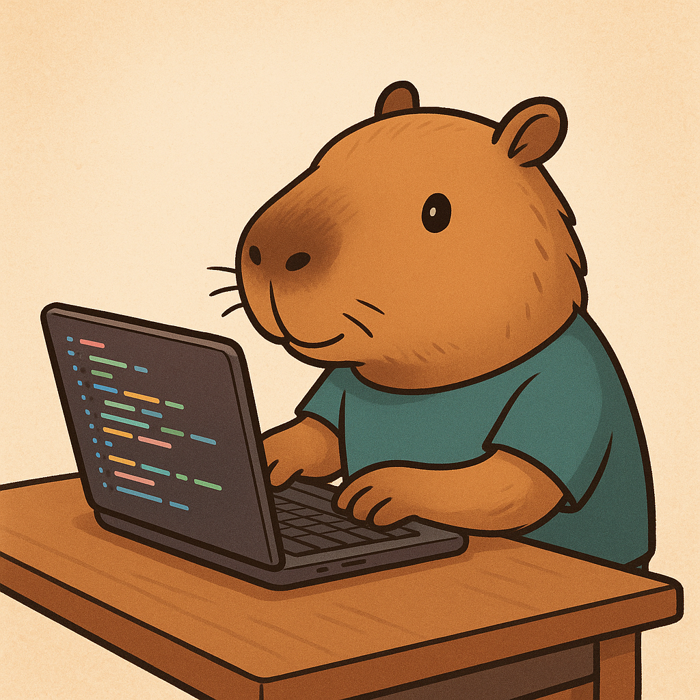
         
        <b>박세민</b>
         
        <a href="https://github.com/">@semin980520</a>
      </td>
      <td align="center">
        
         
        <b>이병찬</b>
         
        <a href="https://github.com/2001056">@2001056</a>
      </td>
      <td align="center">
        
         
        <b>조현준</b>
         
        <a href="https://github.com/chohj2614">@chohj2614</a>
      </td>
    </tr>
  </table>

# 목차

1. [프로젝트 개요](#1-프로젝트-개요)  
   
2. [주요 기능](#2-주요-기능)
3. [기술스택](#3-기술스택) 

4. [WBS](#4-wbs)  

5. [UML](#5-uml)  

6. [요구사항 명세서](#6-요구사항-명세서)  

7. [DB 모델링](#7-db모델링)
   
8. [DB 설계](#8-db-설계)

9. [테스트 케이스](#9-테스트-케이스)   
   

 

# 1. 프로젝트 개요

## 1-1. 📘프로젝트 소개

 본 프로젝트는 온라인 강의 제공자와 학습자를 연결하는 교육 콘텐츠 플랫폼을 설계하기 위한 데이터베이스 구축 프로젝트이다.
프로그램·디자인·비즈니스 등 다양한 분야의 강의가 업로드되고, 사용자가 자유롭게 수강·평가·소통할 수 있는 구조를 지원하는 것이 목표이다.
플랫폼의 핵심 기능인 강의 관리, 사용자 관리, 학습 진행 기록, 결제·정산, 커뮤니티 기능 등을 체계적으로 구현할 수 있도록 ERD를 포함한 전체 DB 구조를 설계한다.
이를 통해 온라인 교육 플랫폼 운영에 필요한 기반 시스템의 구조적 이해를 높이고, 실제 서비스 개발로 이어질 수 있는 확장성과 안정성을 갖춘 DB 모델을 완성한다.

## 1-2. 📗 프로젝트 기획 배경
온라인 교육 시장은 지속적으로 성장하고 있으며, 누구나 제작한 강의를 공유할 수 있는 콘텐츠 중심 플랫폼 모델의 수요 또한 증가하고 있다.
기존 플랫폼들은 다양한 기능—강의 판매, 리뷰, Q&A, 강사 수익 정산 등—을 포함하고 있어 복잡도와 유연성을 동시에 요구하는 DB 구조가 필요하다.

## 1-3. 📘 기존 플랫폼과의 차별점

본 프로젝트가 지향하는 교육 플랫폼은 단순히 온라인 강의를 제공하는 데서 머무르지 않고, 학습자의 커리어 개발까지 연결되는 통합형 서비스를 목표로 한다. 기존의 온라인 교육 플랫폼들은 강의 추천, 수강 관리, 리뷰 제공 등 학습 과정 중심의 기능에 집중하는 반면, 본 프로젝트는 교육과 채용을 직접적으로 연결하는 구조를 통해 플랫폼의 활용 범위를 확장한다.

가장 큰 차별 요소는 강의 콘텐츠와 채용공고 정보를 연동하여 학습자의 취업 가능성을 높이는 기능이다. 사용자는 강의 수강 중에도 해당 강의와 관련된 직무나 스킬을 요구하는 최신 채용공고를 확인할 수 있으며, 이를 기반으로 목표 직무에 맞춘 강의 선택, 학습 로드맵 구성, 취업 전략 수립이 가능하다. 이처럼 학습 데이터와 채용 데이터를 결합함으로써, “무엇을 배울지”에서 “왜 배우는지”까지 명확하게 제시하는 실질적 커리어 지원 플랫폼으로 차별화된다.

또한 강의–기술 태그–직무–채용 정보 간의 관계를 체계적으로 구축해 학습자의 관심 분야에 대한 맞춤 채용 추천이 가능하며, 수강 기록을 기반으로 한 직무 매칭, 스킬 기반 채용 필터링 등 기존 플랫폼에서는 제공하지 않는 커리어 지향적 추천 시스템을 구현할 수 있다. 이를 통해 학습자는 단순한 지식 습득을 넘어 실제 취업 기회로 이어지는 경험을 제공받으며, 플랫폼은 교육과 경력을 자연스럽게 연결하는 새로운 가치를 창출한다.

# 2. 주요 기능

본 프로젝트에서 설계하는 교육 플랫폼의 데이터베이스는 강의 제공, 학습 관리, 커뮤니티 소통, 결제 시스템, 그리고 채용 정보 연동까지 포함한 전반적인 서비스 운영을 지원한다. 이를 위해 다음과 같은 핵심 기능들을 중심으로 구조를 설계한다.
### 2-1. 🛠️ 강의 관리 시스템
 강의 업로드, 카테고리 분류, 기술 태그 설정, 강사 정보 관리 등 강의 콘텐츠 운영 전반을 지원한다. 강의별 커리큘럼, 강의 영상, 자료 업로드 등의 요소가 체계적으로 관리될 수 있도록 구성한다.

### 2-2. 🛠️ 사용자 관리 및 학습자 정보 구조
 학습자·강사 등 사용자 유형별 권한 관리, 프로필 정보, 학습 기록, 관심 강의, 구매 내역 등을 관리한다. 수강 진행도, 수료 여부 등 학습 이력을 기반으로 서비스 운영에 필요한 사용자 데이터를 제공할 수 있도록 한다.

### 2-3. 💡 수강·학습 진행 관리 기능
 사용자가 실제로 어떤 강의를 언제 수강했고 어느 단계까지 학습했는지 기록한다. 이를 통해 학습률 분석, 수료 여부 표시, 강의 콘텐츠 개선 등 서비스 운영 측면의 다양한 활용이 가능하다.

### 2-4. 💰 결제 및 정산 기능
 강의 구매, 결제 이력 관리, 환불 처리 등을 포함하며, 강사에게 지급되는 수익 정산 구조까지 고려한다. 강의 가격 정책, 할인, 쿠폰 등도 DB 기반으로 관리될 수 있도록 설계한다.

### 2-5. 💬 커뮤니티 및 상호작용 기능
 Q&A, 리뷰, 댓글, 평점 등 사용자 간 상호작용을 지원한다. 학습자가 강사 또는 다른 학습자와 소통하며 학습 경험을 확장할 수 있도록 게시물, 반응, 신고 기능 등이 데이터 단위로 구성된다.

### 2-6. 🌟 채용공고 연동 기능 (차별점 핵심)
 강의와 기술 태그를 기반으로 관련 직무·기업 채용공고를 함께 제공하는 기능이다. 사용자는 수강 중인 강의와 연결된 취업 기회를 즉시 확인할 수 있으며, 스킬 기반 채용 필터링, 직무–기술 매칭 등 기존 교육 플랫폼에서 제공되지 않는 기능을 구현할 수 있다.

 

# 3. 기술스택

📌 개발 환경
---

🔧
 DBMS

  
  

---

📌
 협업 및 관리 도구
🤝
 협업 도구

  
  

🗂
 버전 및 이슈 관리

  

📊
 데이터 관리

  

---

📌
 ERD 및 다이어그램 도구

  
  

 

 

# 4. WBS

📜WBS

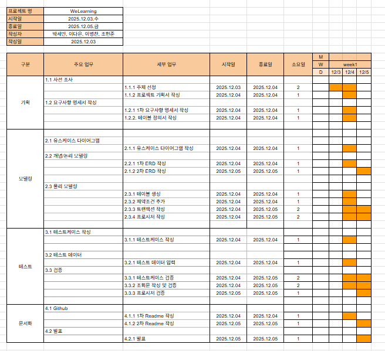

 

# 5. UML

🎨UseCase Diagram

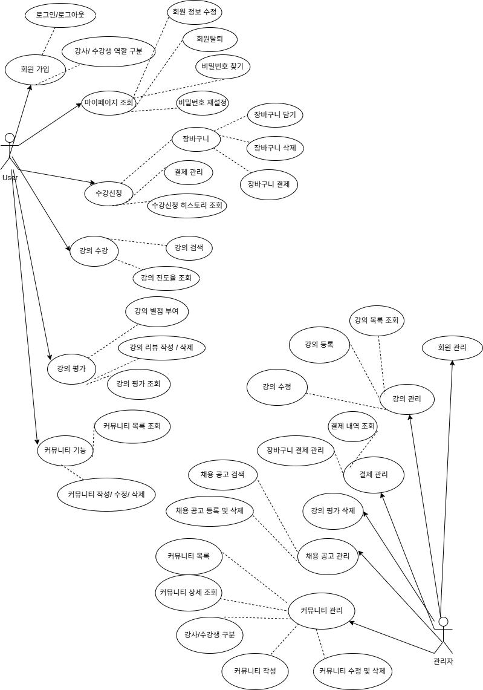

 

# 6. 요구사항 명세서

👥회원

  
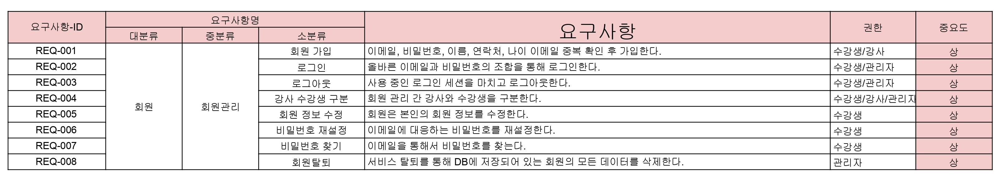

🎓강의

  
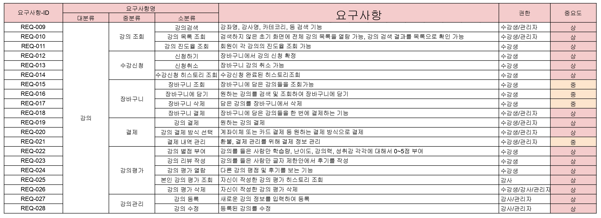

📢채용공고

  
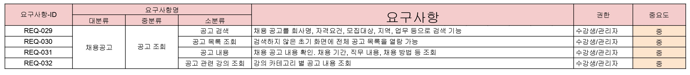

💬커뮤니티

  
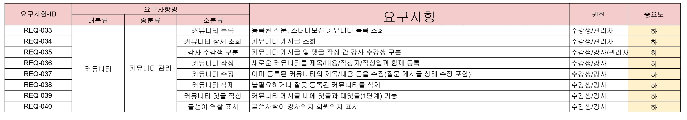

 

# 7. DB모델링

🧱ERD

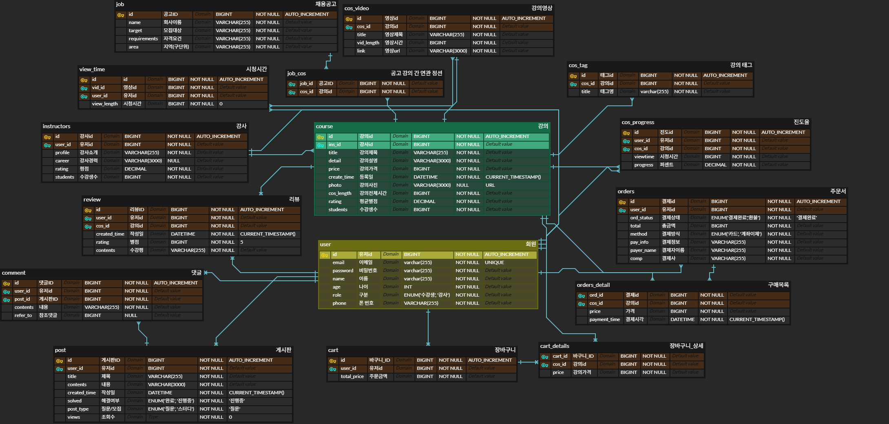

 

# 8. DB 설계

  
🧩 테이블 구조

  

    
  

📐 DB 설계

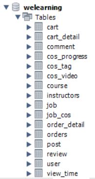

🗒️ 테이블 정의서

  
  
  

 

# 9. 테스트 케이스

    
🔑 공통 기능 및 인증

  <ul>    
      <li>

                
로그인 성공/실패

                

                    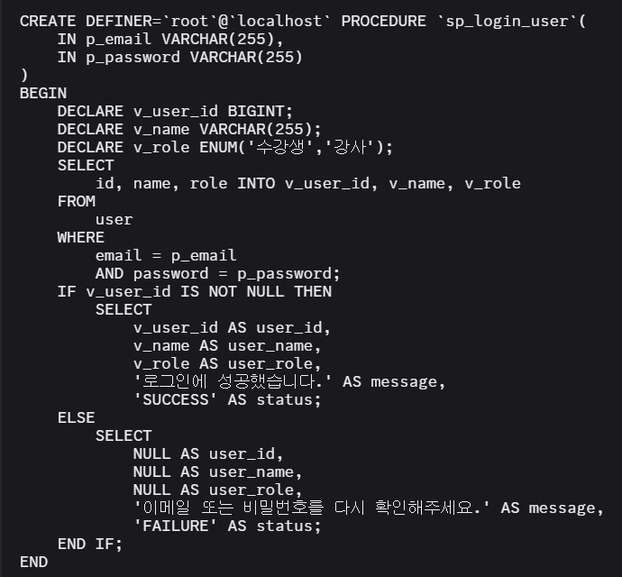
                     
                    
                    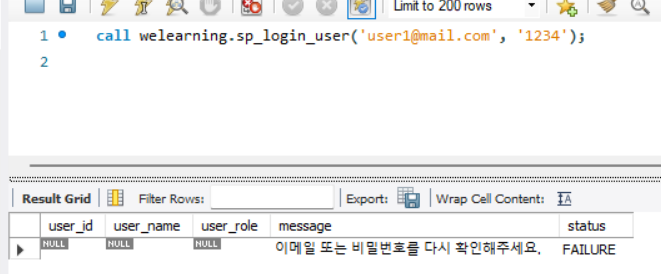
                

        
</li>
    </ul>    
    <ul>
        <li>

            
중복 이메일 가입 실패

            

                
            

        
</li>
    </ul>
    <ul>
        <li>

            
장바구니 목록 조회

            

                
            

        
</li>
    </ul>
    

    
📚 강의 및 수강생 관리 기능

    <ul>
        <li>

            
특정 강의 검색

            

                
            

        
</li>        
        <li>

            
특정 강의 상세 검색

            

                
            

        
</li>
    </ul>    
    <ul>
        <li>

            
특정 강의 평점 조회

            

                
            

        
</li>        
        <li>

            
특정 강의 리뷰 조회

            

                
            

        
</li>
    </ul>
    <ul>
        <li>

            
수강 신청한 목록 조회

            

                
            

        
</li>        
        <li>

            
수강생별 진도 확인

            

                
                 
                
            

        
</li>   
        <li>

            
수강 취소 조회

            

                
            

        
</li>
    </ul>

    
💬 커뮤니티 및 Q&A 기능

    <ul>
        <li>

            
글 조회

            

                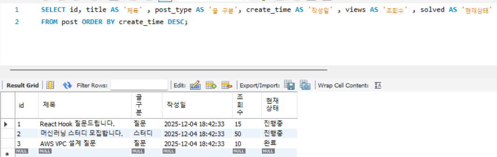
            

        
</li> 
        <li>

            
게시글 내 댓글 조회

            

                
            

        
</li>
    </ul>

    
🏢 채용 공고 및 연관 검색 기능

    <ul>
        <li>

            
채용 공고 조회

            

                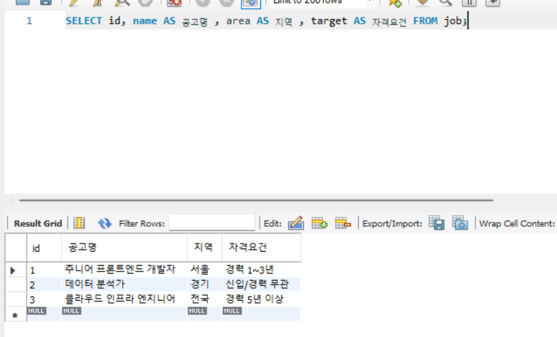
            

        
</li>  
        <li>

            
채용 공고 상세 조회

            

                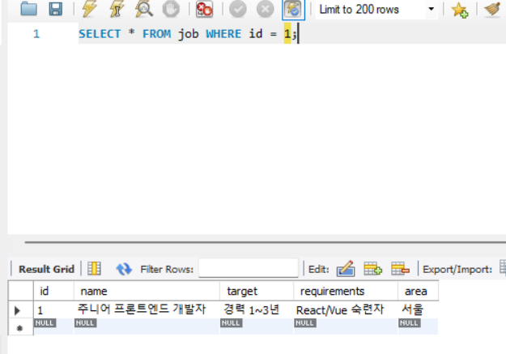
            

        
</li>      
        <li>

            
조건별 공고 검색 기능

            

                
            

        
</li>      
        <li>

            
공고별 연관 카테고리 조회

            

                
              

        
</li>
    </ul>
        

      

    
📝 리뷰 기능

    <ul>
        <li>

            
리뷰쓰기 전 테이블

            

                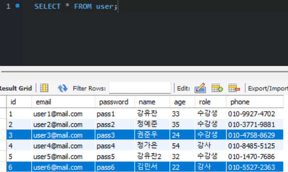
                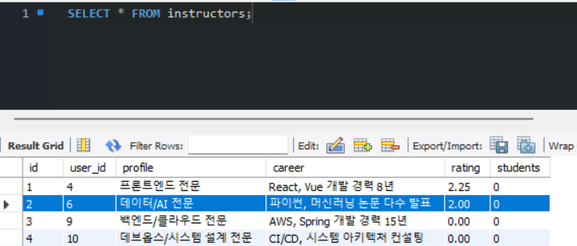
                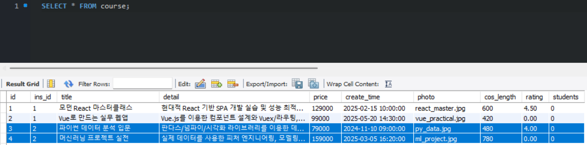
                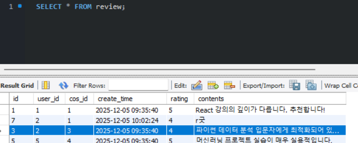
                
50%이상 강의 수강자임을 확인
 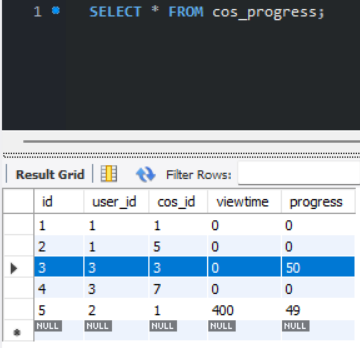
            

        
</li>
        <li>

            
리뷰쓰기

            

                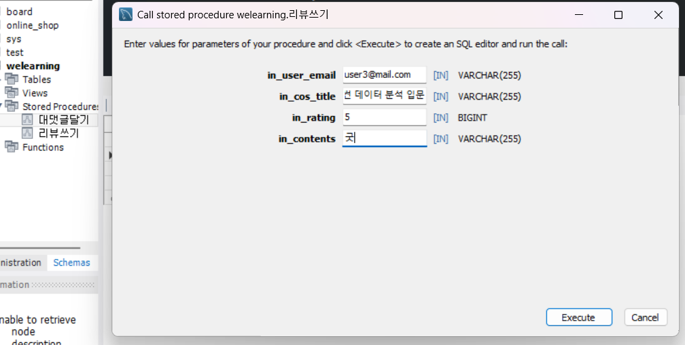
            

        
</li>
        <li>

            
리뷰 완료 후 테이블 확인

            

                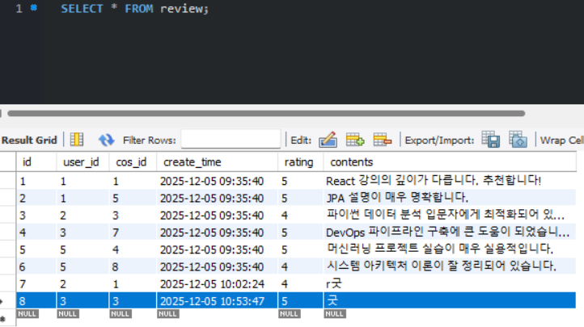
                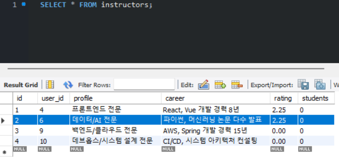
                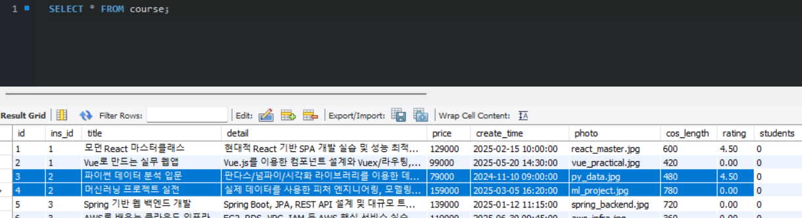
            

        
</li>
      <li>

            
강사가 리뷰를 쓰는 경우

            

                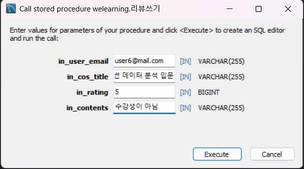
                 
                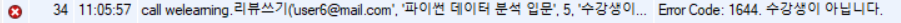
            

        
</li>
        <li>

            
없는 강의에 대한 리뷰 입력

            

                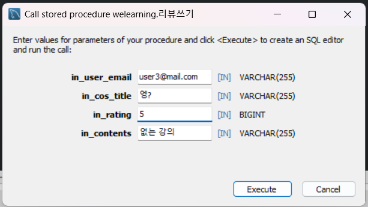
               
                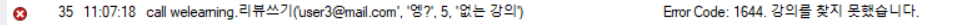
            

        
</li>
        <li>

            
잘못된 이메일 입력 후 리뷰작성

            

                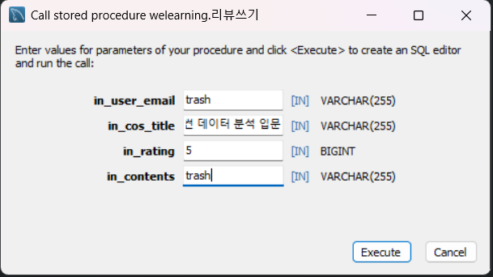
               
                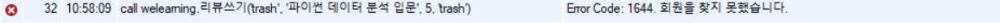
            

        
</li>
      <li>

            
평점 범위 초과 후 입력

            

                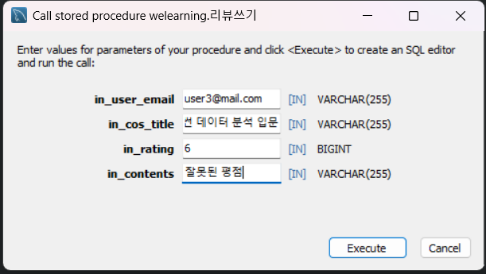
               
                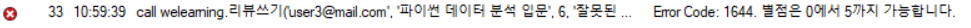
            

        
</li>
      <li>

            
진도율 50% 미만자가 리뷰 쓴 경우

            

                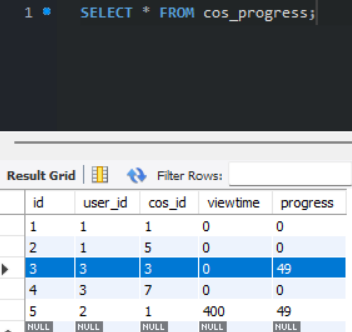
              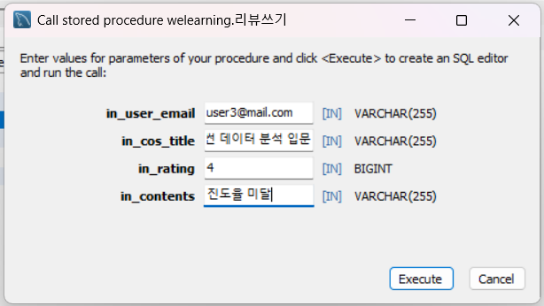
               
                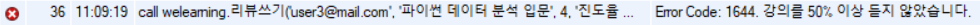
            

        
</li>
    </ul>

       

    
💬 댓글 기능

    <ul>
        <li>

            
원댓글 입력/결과

            

                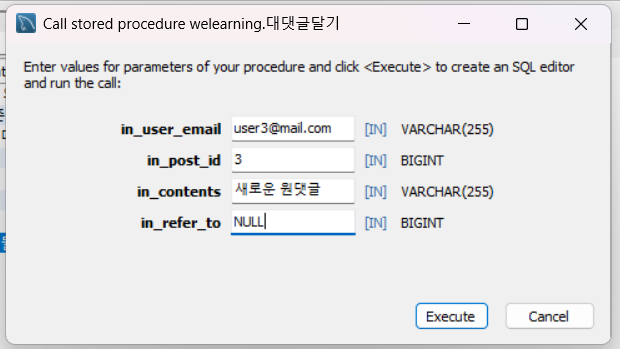
                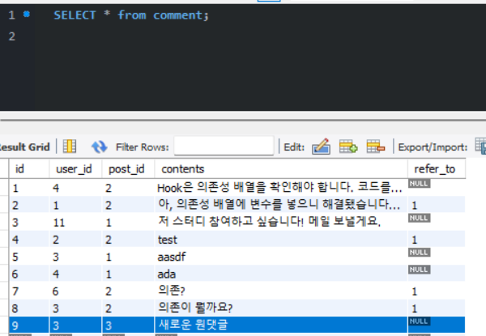
            

        
</li>  
        <li>

            
대댓글 쓰기

            

            
대댓글 쓰기 전

                
            
대댓글 쓰기 전

                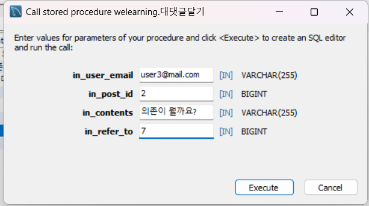
                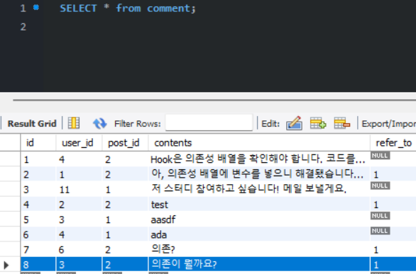
            

        
</li> 
      <li>

            
없는 글에 댓글 다는 경우

            

                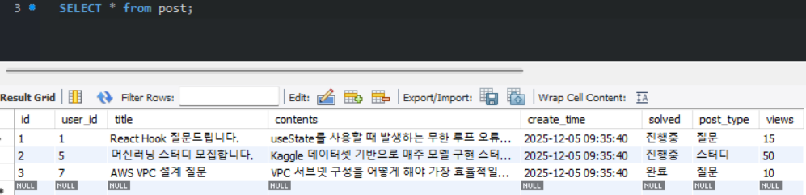
                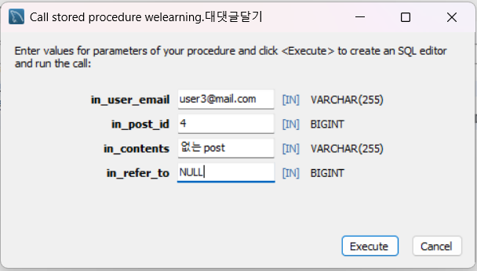
                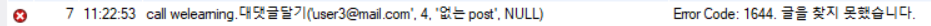
            

        
</li>      
        <li>

            
없는 댓글id에 대댓글 다는 경우

            

                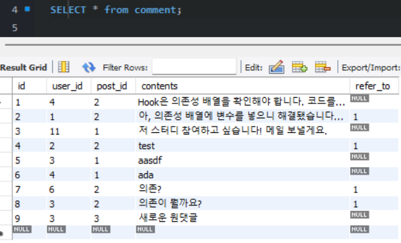
                
                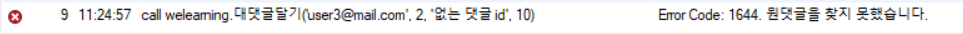
            

        
</li>  
        <li>

            
잘못된 이메일로 댓글 다는 경우

            

                
               
                
            

        
</li>      
        <li>

            
잘못된 이메일 입력 후 리뷰작성

            

                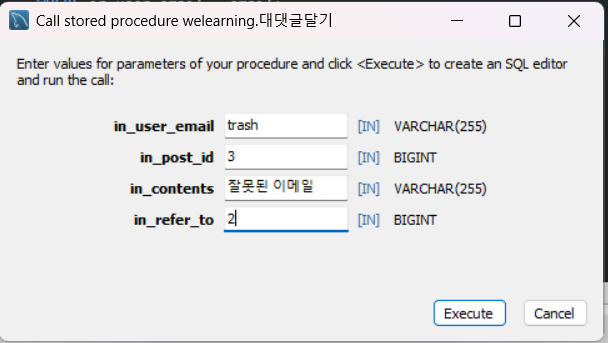
               
                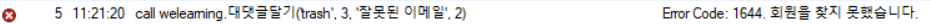
            

        
</li>
    </ul>

 
 
